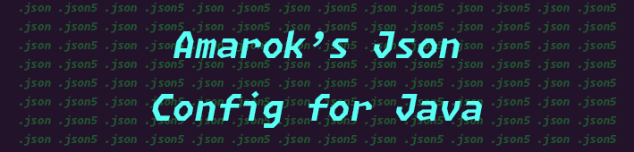

<div align=center>




[](./LICENSE.txt)
[](https://jitpack.io/#AmarokIce/AmarokJsonConfigForJava)

</div>

# Amarok's Json Config for Java (AJC4J)


## Usage
Basic
```java
    private static final Config bean = new Config("./test.json5");
    public static final String TEST_STRING = bean.parse("test_string", "TestString0");
    public static final String TEST_STRING1 = bean.parse("test_string1", "TestString1", "This is second test string!");
    public static final int TEST_INT = bean.parse("test_string1", 5, "This is first test int!");

    public static void init() {
        bean.pop();
    }
```

Codec
```java
public class MyCodec implements Codec<MyObject, MapNode> {
    // Handler
}

public class MyConfigHolder extends ConfigHandler<MyObject> {
    public ConfigHolder(String configName, T defaultValue) {
        this(configName, () -> defaultValue, new MyCodec(), JsonNode.NodeType.Map);
    }
}
```